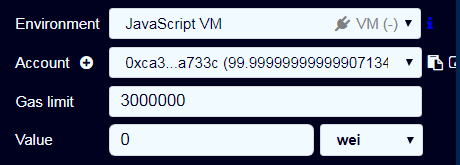

# Overview 

Examples of how to use [Remix](https://remix.ethereum.org/) only to perform Smart Contracts Events Observation 

It is also a useful way to perform runtime debugging 

# Description 

- Compile this very basic [Solidity Events Test Example](solidity_events_test1.sol) with [Remix IDE](https://remix.ethereum.org)

- Now deploy this into the Local JS VM so choose this into the **Remix Target Environment** field 

- Now choose the `Test` Contract and Deploy it 

- Now run the specific `main()` Contract Method 

- Now in the Remix Log go to the Transaction List and find the unique one 

- Now look into Transactions Details and observe the `MyEvent` Event is present with the payload 

